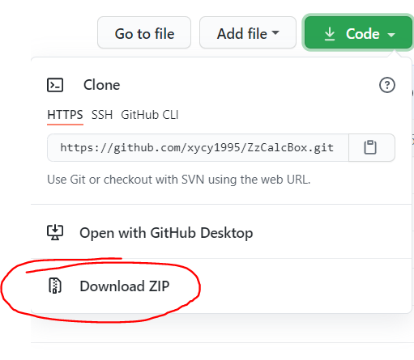
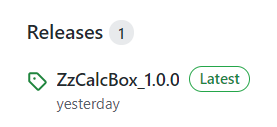

# 【中职计算机】计算工具箱（ZzCalcBox）
#### 一款方便中职学生学习的计算工具。

------------

### 1. 制作意图
- 方便中职计算机专业的学生做题计算，校验最终的答案。
- 可以作为教师教学过程中的辅助工具。

### 2. 下载使用
- 源代码可以直接在本页面右上角点击对应按钮下载最新代码，也可以在Release页面下载释放版代码，下载后自行编译运行。

- 发行版可以在本页右边点击[Release链接](https://github.com/xycy1995/ZzCalcBox/releases "Release链接")，找到最新的版本下载，本软件采用绿色软件的形式，解压即可使用。

***注意：
发行版仅支持64位的Win7、Win10；
Win7用户需要安装【SP1更新包】，且需要更新【KB2533623】补丁，否则无法正常运行。***

### 3. 编译环境
下面提供本人开发环境供大家参考：
- Platform：Windows 10 Profession Edition x64
- IDE：PyCharm 2021.2（Community Edition）
- Python：3.8.10 x64
- PySide：6.1.2

实际要求并没那么严格，只要注意Python是否能够在你的计算机上正常运行，如果Python能正常安装，那么基本没问题。
